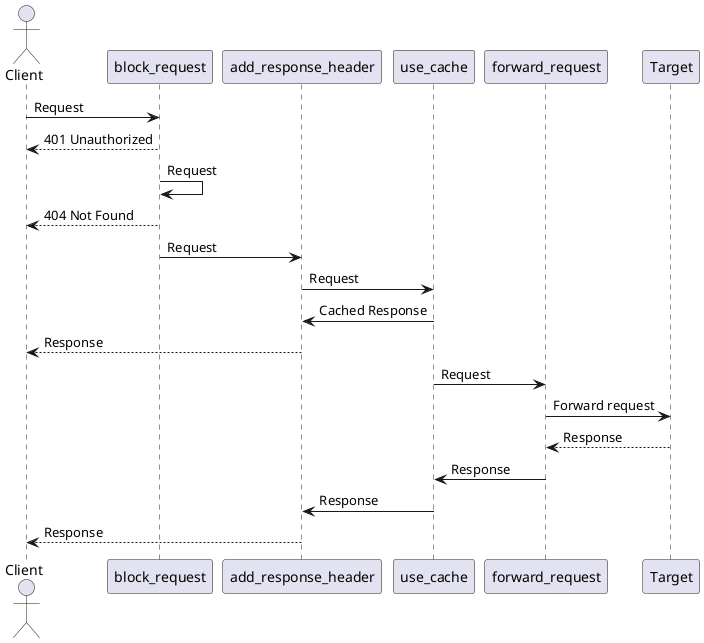

# QPS Benchmarks

```shell
./cacheus > cargo bench --bench qps
./cacheus > curl http://127.0.0.1:3001
./cacheus > k6 run --out dashboard benches/qps_http/k6.js
```



```mermaidjs
sequenceDiagram
    participant Client
    participant block_request_401
    participant block_request_404
    participant add_response_header
    participant use_cache
    participant forward_request
    participant Target

    Client->>block_request_401: Request
    block_request_401-->>Client: 401 Unauthorized
    block_request_401->>block_request_404: Request
    block_request_404-->>Client: 404 Not Found
    block_request_404->>add_response_header: Request
    add_response_header->>use_cache: Request
    use_cache->>add_response_header: Cached Response
    add_response_header-->>Client: Response
    use_cache->>forward_request: Request
    forward_request->>Target: Forward request
    Target-->>forward_request: Response
    forward_request->>use_cache: Response
    use_cache->>add_response_header: Response
    add_response_header-->>Client: Response
```